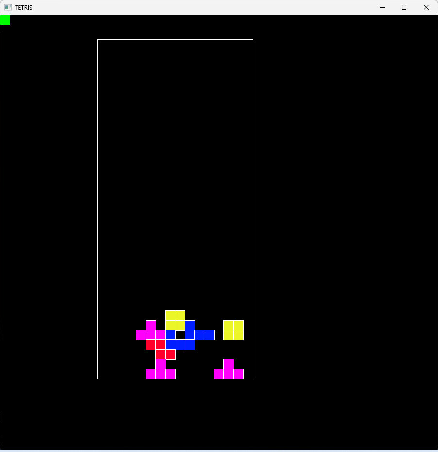

# Tetris

A simple tetris game made in C with the [CSFML](https://www.sfml-dev.org/download/csfml/index-fr.php) library.

## Depencies 

- [CSFML](https://www.sfml-dev.org/download/csfml/index-fr.php) is required in order to compile : include files & precompiled libray files. Change the lib files extension in the project cmake file if your are not using windows.

- Project made with [Msys2](https://www.msys2.org/) on windows

